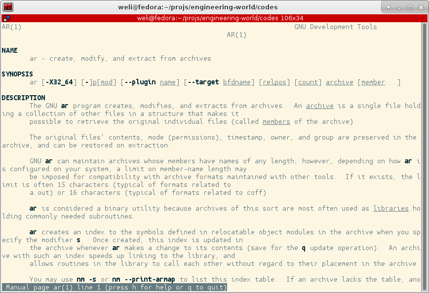

#『阿男的工程世界』＊`.o`文件和`.a`文件（2）＊

首先阿男问大家一个问题，`.o`文件是什么格式？其实稍加思考就应该得出答案，`.o`文件只不过是不完整的可执行程序，所以格式应该就是可执行程序文件格式，而Linux默认格式是`ELF`，那么`.o`文件就应该是`ELF`格式的。我们可以用`objdump`命令来验证这一点：

```bash
$ objdump -D lib1.o | head

lib1.o:     file format elf64-x86-64


Disassembly of section .text:

0000000000000000 <hello>:
   0:	55                   	push   %rbp
   1:	48 89 e5             	mov    %rsp,%rbp
   4:	bf 00 00 00 00       	mov    $0x0,%edi
```

可以看到，`lib1.o`的`file format`是`elf64-x86-64`，验证了我们的分析推测。接下来说说`.a`文件，`.a`文件就是`.o`文件的一个大包。假如我们有多个`.o`文件，那么我们可以使用`ar`命令把多个`.o`文件打包成一个`.a`文件。`ar`命令的`man page`如下：



我们之前写了一个`lib1.c`，把它编译成了`lib1.o`。接下来我们再写一个`lib2.c`：

```c
// lib2.c
#include <stdio.h>

int hello2() {
  printf("Hello, Martian!\n");
}
```

然后把它也编译成目标文件：


```bash
$ cc -g -c lib2.c
```

这样我们就有了两个`.o`文件：

```bash
$ ls lib*.o
lib1.o  lib2.o
```

接下来我们用`ar`命令把两个`.o`文件合并成一个`.a`文件：

```bash
$ ar r lib.a lib1.o lib2.o
ar: creating lib.a
```

这样我们就得到了`lib.a`，里面打包了`lib1.o和`lib2.o`。我们可以用`ar`命令查看`lib.a`里面打包的文件：

```bash
$ ar tv lib.a
rw-rw-r-- 1000/1000   5792 Jan 28 00:36 2017 lib1.o
rw-rw-r-- 1000/1000   5792 Jan 28 12:06 2017 lib2.o
```

值得注意的一点是`ar`命令不光可以打包`.o`文件，理论上它可以打包任何文件，但是一般使用习惯下，`ar`基本上都是和编译过程相关的时候使用，用来给`.o`文件打包的。


