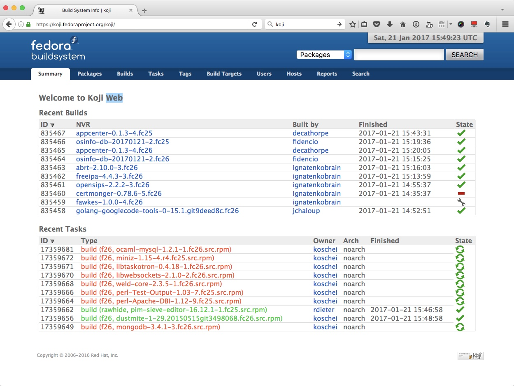
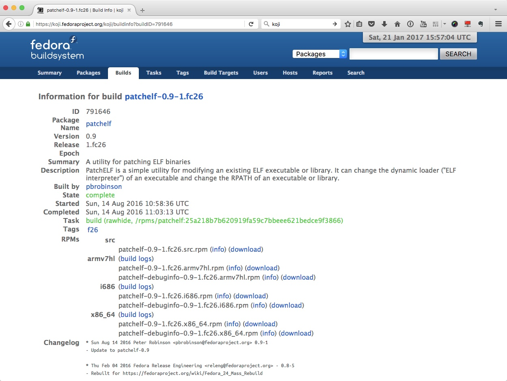
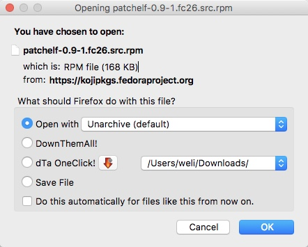

# 『阿男的工程世界』＊使用Fedora来下载Source Package（上）＊

阿男在开发过程中，经常需要某一个项目的源代码，而不是已经编译好的成品。因为阿男是Fedora社区的Commiter[^1]，所以自然也是`Eat my own dog food`[^2]，一直在使用Fedora来工作。

[^1]: https://wiki.duraspace.org/display/FF/New+Committer+Processes
[^2]: https://en.wikipedia.org/wiki/Eating_your_own_dog_food

Fedora是使用`RPM`来封装各个component的安装包，然后用`SRPM`来封装各个component的源代码。我们可以在`koji`上面看到Fedora的各个component[^3]：

[^3]: https://koji.fedoraproject.org/koji/



我们可以点进去一个package，看看具体都包含什么：



可以看到`RPMs`这一栏里面，首先是`src`，就是所谓的`SRPM`，`Source RPM`，这个package里面是这个项目的源代码和build script。

我们可以点击`download`链接，下载所需要的package，比如我们可以把`src`给下载下来：



然后使用`rpm2cpio`命令来解压rpm包：

```bash
$ rpm2cpio patchelf-0.9-1.fc26.src.rpm | cpio -idv
patchelf-0.9.tar.bz2
patchelf-copy-attr.patch
patchelf.spec
325 blocks
```

其中`patchelf-0.9.tar.bz2`是源代码，`patchelf-copy-attr.patch`是补丁文件，`patchelf.spec`是build脚本。

在Fedora的标准编译过程中，`spec`文件是用来执行的编译脚本，它会负责把源代码的压缩包解开，然后打补丁，最后编译，这个过程你可以在本地做，但Fedora的`Koji`系统是用来进行标准化编译的，你最后在用的Linux系统的各个package就是从`Koji`里面来，这个不是本文重点，就不细说了。

以上是从`Koji`里面找到package的源代码包的过程，但是这不是标准过程，Fedora给我们提供了更方便，更标准的方法来下载源代码包，阿男接下来会和大家讲一下。
